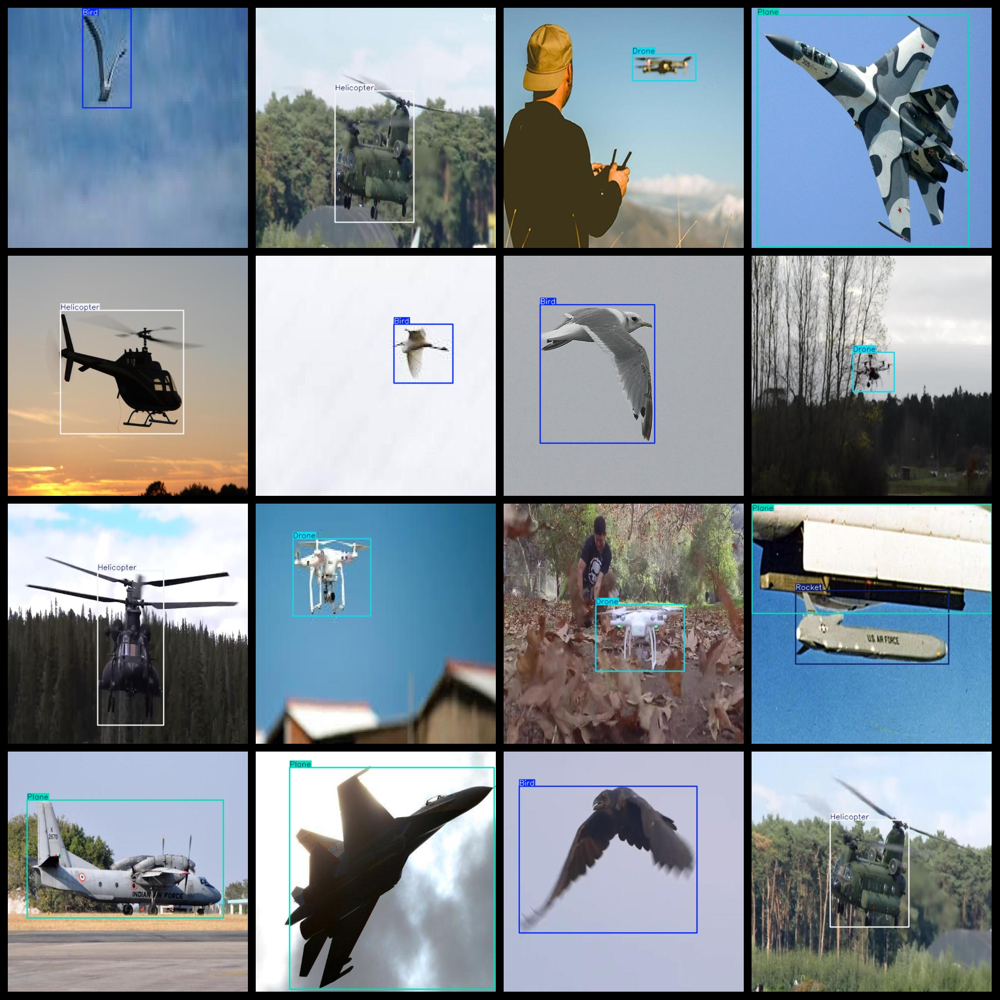
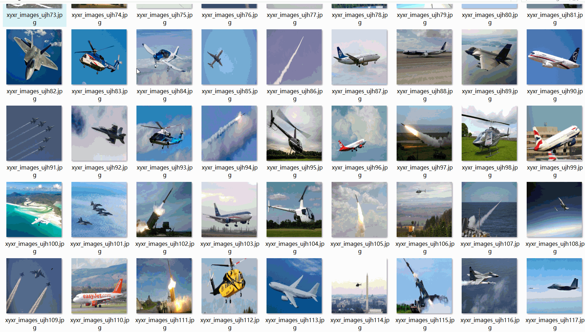

# Aerial Flying Object Detection Dataset 2895 imagesyoloDataset

The aerial flying object detection dataset consists of 2895 images, organized in the VOC format and YOLO format. The dataset is available in three folders: JPEGImages, Annotations, and labels. The JPEGImages folder contains a total of 2895 JPEG images. The Annotations folder contains a total of 2895 XML files, while the labels folder contains a total of 2895 txt files.

The dataset includes five types of labels: ["Bird", "Drone", "Helicopter", "Plane", "Rocket"]. Each label corresponds to a specific category of objects, with the corresponding box numbers as specified in the annotations file, which is located in the Annotations folder.

The number of boxes for each label is as follows:
- Bird: 2137 boxes
- Drone: 1009 boxes
- Helicopter: 680 boxes
- Plane: 684 boxes
- Rocket: 318 boxes

The total number of boxes is 4828.

All images are in high resolution, with clear image clarity. There is no need for image enhancement.

The repository location for this dataset is datasets_sl.

The shape of the labels is a rectangular bounding box, used for target detection and recognition.

This dataset does not guarantee the accuracy or precision of any trained models or weight files. It only provides accurate and reasonable annotations.

The annotation and image details are as follows:

## Images

---

Here is a pay link on Stripe (https://buy.stripe.com/3cs8yP7sY87d0vu9AB). Please contact me lonlonago@foxmail.com after funding $89, and I will send you a complete data files, thank you!

